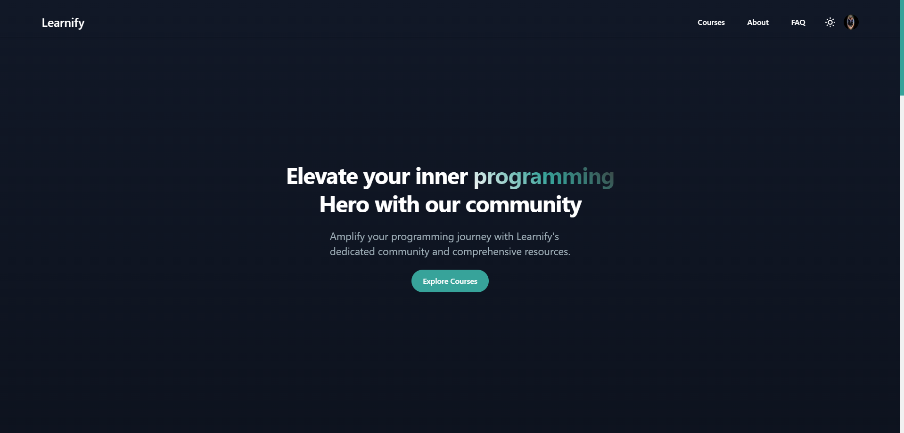

# Learnify

### It's a fullstack application using MERN stack and this is the frontend part of the application

**Live Link**: https://learnify-v1.vercel.app/

<!-- **Preview**: [YouTube](https://youtu.be/) -->

**Frontend Repository**: https://github.com/Najmul11/LMS-SkillDigger/tree/main/frontend  
**Backend Repository**: https://github.com/Najmul11/LMS-SkillDigger/tree/main/server

### Library and tools used in frontend

**Library**: `Next js`

**UI and styling**: `Material UI`, `Tailwind CSS`

**Type Safety**: `TypeScript`

**Icon Library**: `React Icons`, `Material Icons`

**Form and validations**: `Formik`

### Library and tools used in backend

**Server**: `Node js`, `Express js`

**Database**: `Mongoose`

**Type Safety and validation**: `TypeScript`

**Authentication and authorization**: `jsonwebtoken`, `bcrypt`

**Linting and prettifying**: `ESLint`, `Prettier`

### Features (frontend)

- [x] Login, signup method with strict password validation
- [x] Digital rights management with VdoCipher
- [x] Dashbaord based on user role
- [x] Fully mobile responsive for good user experience
- [x] Handles loading, error, success state throughout the application to ensure robust user experience

### Features (backend)

- [x] Login, signup method with strict password validation
- [x] Different level of access for different user roles
- [x] Use of global error handling for good user experience
- [x] Use of transaction for ensuring well data flow
- [x] Module folder structure and good seperation of concerns applied

**Follow package.json for more scripts**

### Thanks for visiting this page, contact me at: [Najmul Hoque](https://www.linkedin.com/in/najmulhoque-/)
