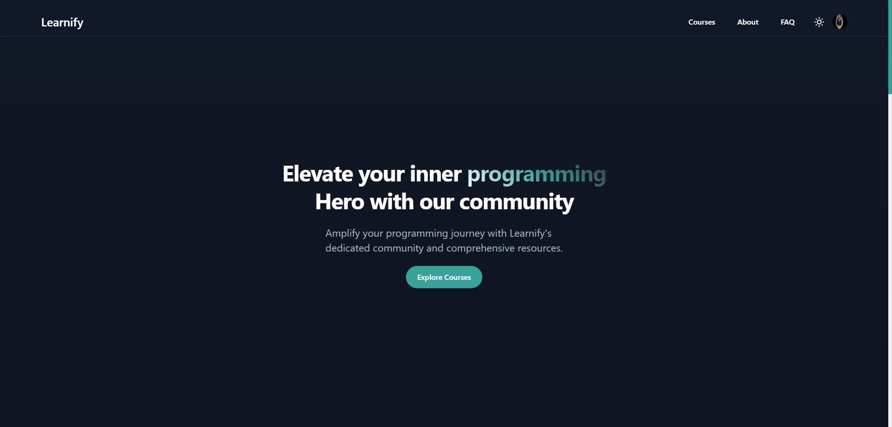

# Learnify

### It's a fullstack application using MERN stack and this is the backend part of the application

<!-- **Preview**: [YouTube](https://youtu.be/) -->

**Frontend Repository**: https://github.com/Najmul11/LMS-SkillDigger/tree/main/frontend

### Library and tools used in backend

**Server**: `Node js`, `Express js`

**Database**: `Mongoose`

**Type Safety and validation**: `TypeScript`

**Authentication and authorization**: `jsonwebtoken`, `bcrypt`

**Linting and prettifying**: `ESLint`, `Prettier`

### Features (backend)

- [x] Login, signup method with strict password validation
- [x] Different level of access for different user roles
- [x] Use of global error handling for good user experience
- [x] Use of transaction for ensuring well data flow
- [x] Module folder structure and good seperation of concerns applied
